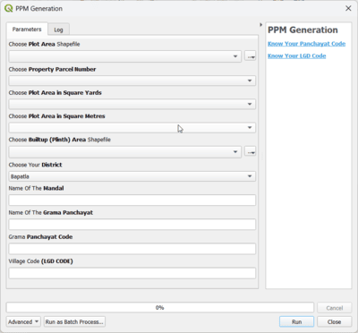

# 🗺️ Property Parcel Map Generator

The **Property Parcel Map Generator** is a QGIS Processing Algorithm that automates the generation of parcel-wise Property Parcel Maps. It uses plot and built-up shapefiles to generate map-ready outputs with symbology, labels, and atlas setup.



## 📋 Prerequisites Before Running the Tool

To avoid errors and ensure smooth tool operation, complete the following setup steps:

### ✅ 1. Save Your QGIS Project

- Your QGIS project **must be saved** (`.qgz`) before running the tool.

- All output files will be created relative to the **saved project folder**.

### ✅ 2. Ensure Matching Coordinate Reference Systems (CRS)

- Both **plot** and **built-up shapefiles** must use the **same CRS**.

### ✅ 3. Data Quality Requirements

- The **plot shapefile** must contain:
  
  - A unique **parcel ID field**
  
  - **Area in square yards** and **square meters** fields

- The **built-up shapefile** should:
  
  - Contain polygons that lie within the plot boundaries

### ✅ 4. Do Not Use the Same Layer for Plot and Built-up

- **Plot and Built-up layers must be different**.

- Using the same layer for both inputs will cause errors.

## 🛠️ Input Parameters

| Parameter                                   | Description                          | Example         |
| ------------------------------------------- | ------------------------------------ | --------------- |
| **Choose Plot Area Shapefile**              | Polygon layer with land parcels.     | `plot_area.shp` |
| **Property Parcel Number Field**            | Field used to identify each parcel.  | `prop_id`       |
| **Plot Area in Square Yards Field**         | Area field in square yards.          | `AREA_SQYRD`    |
| **Plot Area in Square Metres Field**        | Area field in square meters.         | `SHAPE_Area`    |
| **Choose Built-up (Plinth) Area Shapefile** | Built-up polygon layer inside plots. | `builtup.shp`   |
| **District Name (English)**                 | Choose your district.                | `Srikakulam`    |
| **Mandal Name**                             | Name of the Mandal.                  | `Tekkali`       |
| **Grama Panchayat Name**                    | Name of the Panchayat.               | `Anandapuram`   |
| **Grama Panchayat Code**                    | Panchayat code.                      | `123456`        |
| **Village LGD Code**                        | Village code (LGD).                  | `567890`        |

## 🚀 How to Use the Tool

Follow these steps to successfully use the **Svamitva PPM Generator**:

### Step 1: Prepare Your Data

- Ensure your **plot area shapefile** and **built-up area shapefile** are ready.

- Both layers **must use the same CRS** as your QGIS project.

- Your QGIS project **must be saved** before running the tool.

### Step 2: Open the Tool

1. In **QGIS**, go to:

   ```
   Processing ▶ Toolbox ▶ Gruhanaksha ▶ PPM Generation
   ```

2. Double-click the tool to launch the input form. or

3. Click on the Icon in the Toolbar or

4. From Plugin Menu:

   ```
   Plugins ▶ Gruhanaksha ▶ PPM Generation
   ```

### Step 3: Fill in the Parameters

- Select your **plot** and **built-up** shapefiles.

- Choose the correct **fields** for `Property ID`, `Area in Yards`, and `Area in Meters`.

- Fill in **district**, **mandal**, **panchayat**, and **village code** details.

### Step 4: Run the Tool

- Click **Run**.

- The tool will:
  
  - Validate inputs and CRS
  
  - Add calculated fields (`Ref_Col`, `Length`, `Area`)
  
  - Create boundary/exploded lines and vertices
  
  - Save new layers to the **project directory**
  
  - Apply styles from QML files
  
  - Label the parcels
  
  - Load a print-ready **A4 Atlas template**

### Step 5: View Results

- You will see new layers in the **Layers Panel**:
  
  - `Plot_ExplodeLines`, `Builtup_ExplodeLines`, `Plot_Shapefile`, `Builtup_Shapefile`, `Plot_Vertices` etc.

- Check for **labels** and **colors** applied automatically.

### Step 6: Export Maps

1. Go to `Project ▶ Layout Manager`

2. Open **A4_PPM_TEMPLATE**

3. Click **Atlas ▶ Preview Atlas**

4. Use `Atlas ▶ Export as PDF` or `Print`

## 📦 Outputs

| Output File                | Description                         |
| -------------------------- | ----------------------------------- |
| `Plot_Boundary.shp`        | Boundary of plot areas              |
| `Plot_Shapefile.shp`       | Plot area shapefile                 |
| `Builtup_Shapefile.shp`    | Intersected built-up shapefile      |
| `Plot_ExplodeLines.shp`    | Exploded lines with length          |
| `Builtup_ExplodeLines.shp` | Built-up exploded lines             |
| `Plot_Vertices.shp`        | All vertices of plot polygons       |
| `Builtup_Boundary.shp`     | Boundary of built-up                |
| `A4_PPM_TEMPLATE`          | Print layout ready for Atlas export |

## 📂 Output Location

- All output layers are saved inside the **same folder** where your `.qgz` project file is saved.

- If your project is **not saved**, the tool will raise an error.

## ⚠️ Common Errors & Fixes

| Error                            | Solution                                                        |
| -------------------------------- | --------------------------------------------------------------- |
| CRS Mismatch                     | Ensure both layers and project have same CRS (e.g., EPSG:32645) |
| Same Layer for Plot and Built-up | Use two **different shapefiles**                                |
| Missing Style File               | Check if `assets_folder` contains all `.qml` and `.qpt` files   |
| Unsaved Project                  | Save the QGIS project before running the tool                   |

## 💡 Pro Tips

- Use clean and properly named fields in your input layers.

- Don't rename files to reserved names like `Plot_ExplodeLines`, `Builtup_ExplodeLines`, `Plot_Shapefile`, `Builtup_Shapefile`, `Plot_Vertices`.

- Save the QGIS project and keep it organized before starting.

- You can customize `.qml` and `.qpt` styles to match your district’s format.

## ❗ Help & Support

If you encounter issues:

- Recheck your inputs and field names.

- Ensure all style/template files exist.
