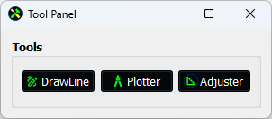
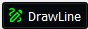
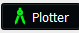
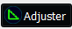

# 🛠️ Tool Panel

The **Tool Panel** is a floating window inside QGIS that gives access to multiple custom tools, useful for working with land parcels, base lines, and plotting boundaries. It includes buttons for:

- **[DrawLine](./drawline)** – For drawing base lines and circles.

- **[Plotter](./fmb)** – For visualizing and plotting triangles, bisectors, and angle tools.

- **[Adjuster](./polygon_adjuster)** – For adjusting polygon areas or shapes interactively.

## 🧭 Opening the Tool Panel

Once the plugin is installed, the Tool Panel can be opened from:

- A **toolbar button**, or

- Automatically as a **floating window** when QGIS starts (depending on your setup).

The panel appears with the title: **“Tool Panel”** and includes three buttons grouped under the label **“Tools”**.

## 🧩 Buttons in the Tool Panel

### 1. 🔷 **DrawLine**

- **Icon:** 

- **Use this to:**  
  Open the **Baseline Tool** which allows drawing reference lines (base lines) for plotting and measurements.

- **Steps:**
  
  - Click **[DrawLine](./drawline)**.
  
  - The baseline tool will open.
  
  - Use it to draw a line between two known points.

### 2. 📐 **Plotter**

- **Icon:** 

- **Use this to:**  
  Open the **[Combined Plotter Tool](./fmb)**, which supports triangle plotting, angle bisectors, and more.

- **Requirements:**  
  You must select **one line feature** from a line layer.

- **What it shows:**
  
  - Displays the **Start Point** (green) and **End Point** (red) on the selected line.
  
  - Opens a visual tool for plotting geometry based on those points.

### 3. 🧮 **Adjuster**

- **Icon:** 

- **Use this to:**  
  Open the **[Polygon Adjuster Tool](./polygon_adjuster)**, which helps resize or reshape polygon areas.

- **Example:**  
  Increase the area of a plot while maintaining its general shape.

## 🗂️ Important Behavior

- The **Plotter** and **Adjuster** tools use data from the currently **selected feature(s)** in your active QGIS layer.

- If you haven’t selected anything, or if the layer type is wrong (e.g., points instead of lines), you’ll see a helpful error message.

## 🎨 Automatic Styling

When you use the **Plotter Tool**, it creates a point layer named **“Start and End Points”**:

- The **Start Point** is shown in **green**.

- The **End Point** is shown in **red**.

- You can see this layer in the **Layers Panel**, and it updates every time you select a new line and reopen the plotter.

## ✅ Tips for Best Use

- Always make sure you select the correct feature before using a tool.

- Only **one feature** should be selected when using the **Plotter Tool**.

- You can clear or delete the **“Start and End Points”** layer if not needed later.

## ❗ Troubleshooting

| Problem                               | What to Do                                                                         |
| ------------------------------------- | ---------------------------------------------------------------------------------- |
| Nothing happens when I click a button | Make sure a valid layer and feature is selected.                                   |
| Error message appears                 | Read the message carefully – it tells you what’s missing (e.g., no line selected). |
| Start/End points are not shown        | Check if the **“Start and End Points”** layer is added and visible.                |
